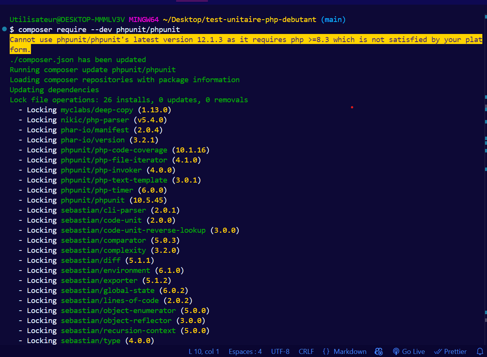
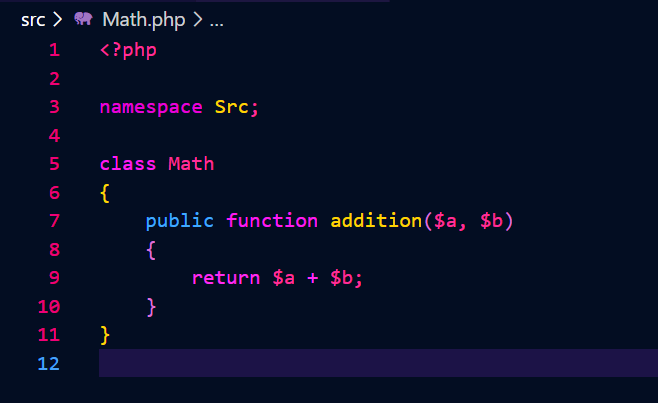
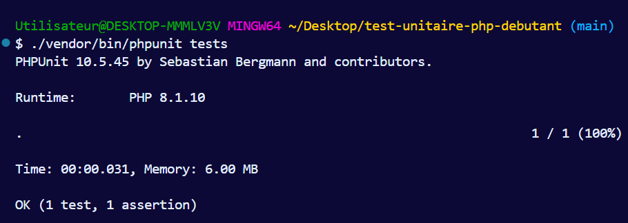
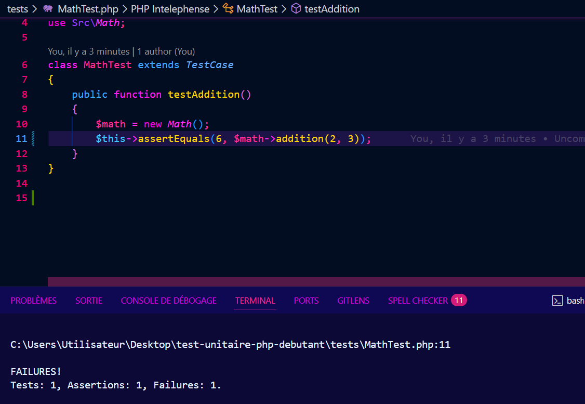

# test-unitaire-php-debutant

## initialiser Composer


```bash
composer init
```

## installer phpUnit



```bash
composer require --dev phpunit/phpunit
```

Création de la class Math


Lancement du test MathTest


Echec du test MathTest



